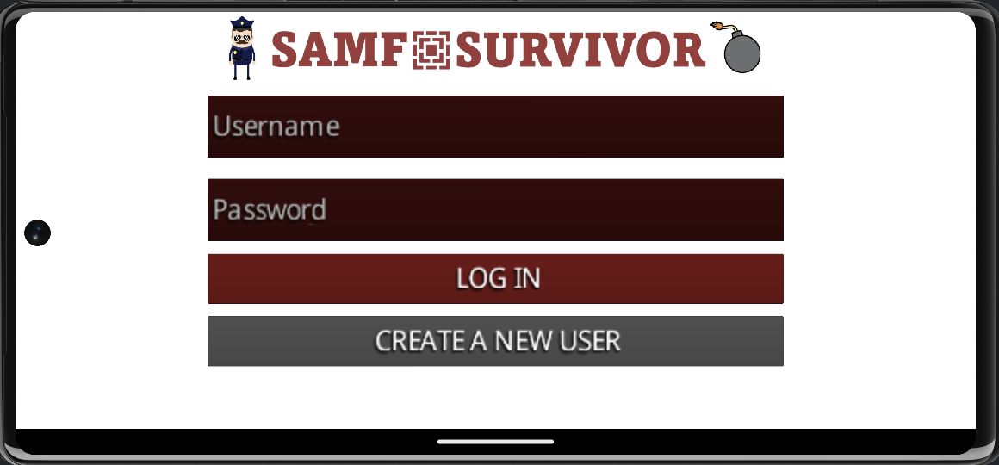
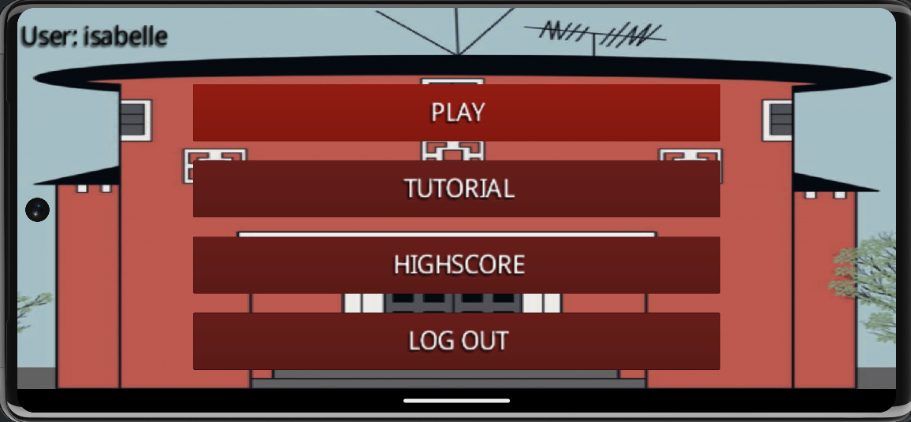
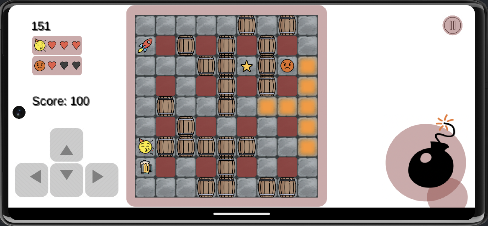
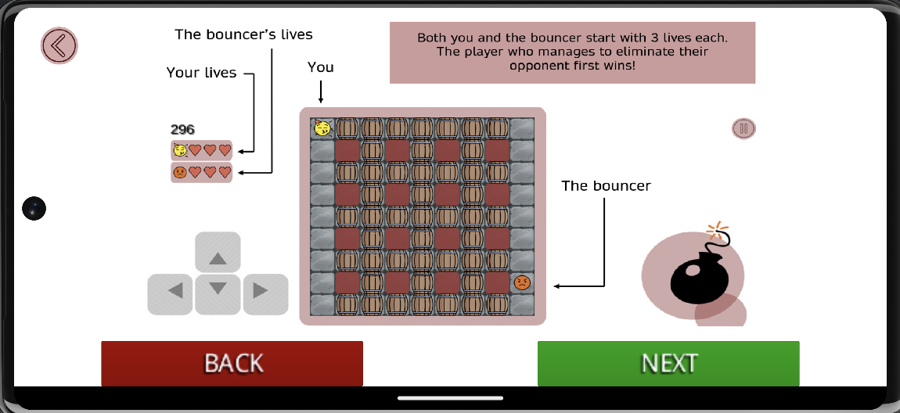

# Samf Survivor
Project in TDT4240 - Software Architecture. 

Samf Survivor is a survival-based game which is inspired by [Playing with Fire 2](https://www.1001games.com/action/playing-with-fire-2), also referred to as “Bomberman”. In the game, the player controls a student at Studentersamfundet in Trondheim that is about to be thrown out by the bouncer. The aim of the game is to eliminate the bouncer by placing bombs and various power-ups strategically on the game board. 

The project is written in Kotlin, using the [libGDX](https://libgdx.com) game development framework. 

## 💻 Project structure

`android` contains Android spesific files.

In `src/com/mygdx/tdt4240`:
- `AndroidAPI` implements the api functions 
- `AndroidLauncher` launches the game on Android devices 

`assets` contains all textures, sounds and fonts.

`core`contains the game code. 

In `core/src/com/mygdx/tdt4240`:
- `api` defines the api that communicates with the Firebase database 
- `sprites` stores sprites used in the game
- `states` contains the various game states
- `utils` provides utility classes 

## 👩‍💻 How to run 

### With Android device

**Compile .apk**

1. In Android Studio, click the Build tab at the top of the window
2. Then click Build Bundle(s) / APK(s) -> Build APK(s)
3. Find the compiled .apk file in TDT4240-SAMF-SURVIVOR\android\build\outputs\apk\debug

**Run .apk**
1. Download the .apk file on your Android phone
2. Install the application
3. In settings, enable the "Storage" permission to allow the web browser to save files to your deivce or the "Install unknown apps"
4. Open the application on your phone

### In Android Studio
1. Create an Android emulator with an Android device
2. Select the Android device in the run configurations 
3. Run the game 

## 🌄 Screenshots
When opening the game, the user can either log in with their existing user or create a new user. 

After this, the user is redirected to the main menu. 

After clicking on the PLAY button, the user can begin playing the game. 

From the main menu, a step-by-step tutorial is also available. 

The user can view their highscore and compare it to other users of the game. 

